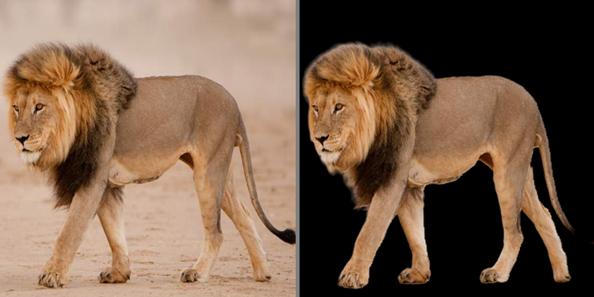

# RMBG-U2NET


## RMBG-U2NET Table of content
+ [1. Establishment](#1-establishment)
    - [1.1. Abstract](#11-abstract)
    - [1.2. Introduction](#12-introduction)
    - [1.3. Motivation](#13-motivation)
+ [2. U-2-Net Architecture](#2-u-net-architecture)
    - [2.1. Residual Blocks](#21-residual-blocks)
    - [2.2. Dilated Convolutions](#22-dilated-convolutions)
    - [2.3. Decoder Block](#23-decoder-block)
    - [2.4. Implementation of U-Net Architecture](#24-implementation-u-net-architecture)
+ [3. Data](#3-data)
    - [3.1. P3M-10K](#31-p3m-10k)
    - [3.2. COD-10K-v3](#32-cod-10k-v3)
    - [3.3. People Segmentation](#33-people-segmentation)
    - [3.4. Dataset Combination](#34-dataset-combination--preproccessing)
    - [3.5. Data Preprocessing](#35-data-preprocessing)
        * [3.5.1. Rename Function](#351-rename-function)
        * [3.5.2. Resize Function](#352-resize-function)
        * [3.5.3. Create csv Function](#353-create_csv-function)
        * [3.5.4. Plot data Function](#354-plot_data-function)
+ [4. Installing and Running the Model](#4-installing-and-running-the-model)
    - [4.1. Install and Load the Model](#41-install-and-load-the-model)
    - [4.2. Prepare the Dataset](#42-prepare-the-dataset)
    - [4.3. Run the Model](#43-run-the-model)
    - [4.3.1. Train the Model](#431-train-the-model)
    - [4.3.2. Load the Pretrained Model](#432-load-the-pretrained-model)
    - [4.4. Background Removal](#44-background-removal)
+ [5. Sytem information](#5-system-info)
+ [6. References](#5-references)

## 1. Establishment 
### 1.1. Abstract
This project  is called RMBG-U2NET, which is a deep learning-based image background removal system using the U-2-Net architecture. The project provides a detailed explanation of the U-Net architecture, the datasets used (P3M-10K, COD-10K-v3, and People Segmentation), and the steps to install and run the model. The model can be trained from scratch or loaded as a pre-trained model, and it can be used for background removal in images for human, animal and objects.

Keywords:

Image Background Removal, U-2-Net, DeepLearning, ComputerVision
P3M-10K, COD-10K-v3, People-Segmentation


### 1.2. Introduction
Image Background Removal using segmentation is a fundamental task in computer vision, where the goal is to classify each pixel in an image as belonging to one of several classes and seprate the wanted pixel and remove the unwanted ones. for this task we will be using U-2-Net based on The U-Net model, which is a popular architecture for image segmentation tasks. firtly lets look at the folder structure of this repository:

```
    RMBG-U2NET
    │
    ├── Data/
    │   ├── Images   
    │   ├── Mask
    │   ├── Dataset.CSV
    │   ├── DATA.md
    │   ├── file/ 
    │   └── test/
    │       ├── util.py 
    │       └── Preprocess.ipynb
    │   
    ├── Preprocess/
    │   ├── util.py 
    │   └── Preprocess.ipynb
    │
    ├── RMBG/
    │   ├── __init__.py 
    │   ├── model.py
    │   └── train.py
    │
    ├── .gitignore
    ├── README.md
    ├── RMBG_ENV.yml
    └── workspace.ipynb
```
### 1.3. Motivation
Image background removal is a crucial task in the field of computer vision, with numerous applications in various domains. The primary motivation behind image background removal is to segregate the foreground object from the background, thereby enabling focused analysis, manipulation, or enhancement of the object of interest. This technique is essential in areas such as image editing, object recognition, and segmentation, 3Dreconstruction where the accurate identification and separation of objects from their surroundings play a pivotal role. From my personal intrest in 3Dreconstruction i look into this project as an opportiunity to be able to finish apart of a bigger project.

In the context of this project, RMBG-U2NET, the motivation for image background removal is to leverage the U-2-Net architecture for efficient and accurate segmentation of objects in images. By utilizing a pre-trained ResNet50 model, the project aims to improve the accuracy of image background removal, making it particularly effective for tasks like image background removal, where both the object of interest (foreground) and the rest of the image (background) need to be accurately identified.

## 2. U-Net Architecture
U-Net Architecture is based on nested U-structure that consists of an encoder that downsamples the input image to extract high-level features, a bridge that applies dilated convolutions to increase the receptive field, and a decoder that upsamples the features to produce a segmentation mask.
this Architecture which allows it to capture high-level semantic information and low-level details simultaneously. combination of low-level features from the encoder with high-level features from the decoder, helps to improve the accuracy of the segmentation.
This makes it particularly effective for tasks like image background removal, where both the object of interest (foreground) and the rest of the image (background) need to be accurately identified.

### 2.4. Implementation U-Net Architecture 
In the next sections, we will discuss the implementation of Image Background Removal using U-2-Net,to implement U-2-Net model we use a pre-trained ResNet50 model. The ResNet50 model is a deep convolutional neural network that has been pre-trained on the ImageNet dataset, which consists of over 1 million images and 1000 classes. By using a pre-trained model, we can leverage the knowledge that the model has already learned from the ImageNet dataset and apply it to our image segmentation task.

We use ResNet50 for first five convolutional blocks that create the The encoder part,and  with skip connections to the decoder. The bridge consists of a dilated convolution with 1024 filters. The decoder consists of four decoder blocks, each of which upsamples the input and concatenates it with skip features from the encoder, followed by a residual block. Four output layers are defined, each of which applies a 1x1 convolution with sigmoid activation to produce a binary segmentation mask. The output masks are concatenated along the channel dimension.

### 2.1. Residual Blocks
Residual blocks are a type of convolutional block that consists of several convolutional layers with batch normalization and ReLU activation, followed by a shortcut connection that adds the input to the output of the convolutional layers. Residual blocks help to improve the accuracy of the model by allowing the gradient to flow more easily through the network, which helps to prevent the vanishing gradient problem.

In this implementation, we define a residual block function that takes an input tensor and a number of filters as arguments. The function applies two 3x3 convolutional layers with batch normalization and ReLU activation, followed by a shortcut connection that adds the input to the output of the second convolutional layer.

### 2.2. Dilated Convolutions
Dilated convolutions are a type of convolutional layer that increases the receptive field of the model by using a larger kernel size with a dilation rate. The dilation rate determines the spacing between the kernel elements, which allows the model to capture larger context without increasing the number of parameters.

In this implementation, we define a dilated convolution function that takes an input tensor and a number of filters as arguments. The function applies three dilated convolutions with dilation rates of 3, 6, and 9 to the input, and then concatenates the outputs and applies a 1x1 convolution with batch normalization and ReLU activation.

### 2.3. Decoder Block
The decoder block is a type of convolutional block that upsamples the input by a factor of 2 and concatenates it with skip features from the encoder, followed by a residual block. The upsampling is performed using bilinear interpolation, which helps to preserve the spatial information of the input.

In this implementation, we define a decoder block function that takes an input tensor, skip features from the encoder, and a number of filters as arguments. The function upsamples the input using bilinear interpolation, concatenates it with the skip features, and then applies a residual block.

It's important to note that while U-2-Net is powerful, the quality of the results can depend on the complexity of the image and the distinctness of the object of interest. we have discussed the implementation of the U-Net model for image segmentation tasks using a pre-trained ResNet50 model. now lets discuss the Data we used to train our model.

## 3. DATA
To train this model we used a dataset that contains a combined dataset of P3M-10K, COD-10K-v3, and People Segmentation datasets. These datasets are widely used in the field of computer vision, particularly in the areas of reflection, shadow, and animal and people segmentation. first lets disscussed each and every dataset used individually:

### 3.1. P3M-10K
P3M-10K is a large-scale portrait matting dataset that contains 10,000 high-resolution portrait images, along with their corresponding alpha mattes and foregrounds. The dataset is divided into training, validation, and testing sets, each containing 7,000, 1,000, and 2,000 images, respectively. in this dataset the faces are blured due to privacy concernes. [Download](https://www.kaggle.com/datasets/rahulbhalley/p3m-10k)

### 3.2. COD-10K-v3
COD-10K-v3 is a large-scale dataset for object detection and segmentation, which contains 10,000 images with 80 object categories. The dataset is divided into training, validation, and testing sets, each containing 7,000, 1,000, and 2,000 images, respectively. [Download](https://drive.google.com/file/d/1vRYAie0JcNStcSwagmCq55eirGyMYGm5/view?pli=1)

### 3.3. People Segmentation
People Segmentation dataset is a collection of images containing people, along with their corresponding segmentation masks. compared to P3M-10k dataset this dataset contains different angles and different variation of pictuires including people inside it. [Download](https://www.kaggle.com/datasets/nikhilroxtomar/person-segmentation?rvi=1)

### 3.4. Dataset Combination
The dataset used in this project is a combination of the P3M-10k and people segmentation datasets, which are two widely used datasets for the human segment of Datasets but the structure of these two datasets is different, the first step was to remove the segmentation folder from people segmentation dataset we only need the human mask after all to remove humans from the background, we left with the original images and masks, for the other people dataset "P3M-10k" firstly we use use the train, it doesn’t need any further preprocess to making the validation part ready we use "P3M-500-NP" folder and we only use "mask" and "original_image" folders, we don't need the other files from this dataset. and finally COD-10k-v3 dataset, from both the "train" and "test" folders, we use Image and "GT_object" folders that contain the mask of the original object, after copying the needed folder we mix all the original images in one folder named images and we use "mask" folders and "GT-object" files into a masks folder, by this we have a dataset contains 25K samples of (.jpg) images and (.PNG) masks, now by a combination of these three rich datasets, our model can be trained on animals, objects and humans.

### 3.5. Data Preprocessing
To  be able  to work with the images and their mask we need some preproccessing steps, there is a Preprocess folder which contain "util.py" and "Preprocess.ipynb" file which are to normalize and regulize the data that we have, that performs several operations on image files in a directory. Here's a breakdown of what each function does:


#### 3.5.1. Rename function: 

This function renames all image files in the specified directory by adding a category prefix to the filename. It checks if the file is an image (either JPG or PNG format) and renames it by appending the category name followed by an underscore and a count number.

#### 3.5.2. Resize function:

This function resizes all image files in the specified directory to the specified size. It checks if the file is an image (either JPG, JPEG, or PNG format) and resizes it using the PIL library. the pictures could be left as they are because we use transformers in the model to resize all the input images also but this function us provided in case the model didn't work on the minimum required settings, you can remove the transformer part from the actual code and resize all the data seprerately.

#### 3.5.3. create_csv function:

This function creates a CSV file containing the image name, path of image, mask path, and category of the image. It traverses through the image path and mask path, gets the image name and category, and writes the image details to the CSV file.

#### 3.5.4. plot_Data function: 

This function plots the number of files for each category in the specified directory. It traverses through the directory, gets the category from the filename, increments the count for the category, and plots the number of files for each category using matplotlib.


*** IMPORTANT NOTICE: In workshop.ipynb file the model is trained only on 1000 sample datafrom the original dataset due to computational limitation ***

## 4. installing and Running the model

### 4.1. install and Load the Model: 
to be able to run the model first step is to clone the repository from GitHub:
You can download the repository to your local machine using git clone command. Open your terminal and type:

```bash
git clone git@github.com:Mehdialmoo/RMBG-U2NET.git
```

in the second step, Once the repository is cloned, navigate to the repository using the cd command:

```bash
cd RMBG-U2NET
```
Install the required packages and the environment:
The repository includes a environment file that lists all the required packages. To install and activate the environment specified in the given YAML file, you can follow these steps:

Open a terminal or command prompt and navigate to the directory where you saved the environment.yml file.
Run the following command to create the new environment:
```bash
conda env create -f environment.yml
```
After the installation is complete, activate the environment using the following command:
```bash
conda activate rmbg_ENV
```
Now, you have successfully installed and activated the environment with the specified packages and dependencies.

### 4.2. Prepare the Dataset:
Due to Github limitation the dataset is uploaded on Kaggle by clicking here[Sample: 1000 images](https://www.kaggle.com/datasets/mehdialmousavie/sample-u-2-net-rmbg) [full : 25k images](https://www.kaggle.com/datasets/mehdialmousavie/full-u2net-rmbg) you will be able to download the dataset. After cloning this repository, you are able to unzip the dataset copy and paste in the following order
```
    RMBG-U2NET/
    │
    ├── Data/
    │   ├── Images   
    │   ├── Mask
    │   ├── Dataset.CSV
    │   ├── DATA.md
    │   ├── file/ 
    │   └── test/
    │       ├── images 
    │       └── masks
    .
    .
```
"file" folder contains the data.CSV file saves the weights and values of our model and "model.h5" which is a checkpoint of the model which if you dont need to train the model you can use this checkpoint by loading it using third cell in "workspace.ipynb" file.

### 4.3. Run the Model:
After following all the steps stated above, there are two methods to follow up either to train the model from scratch or to load the pretrained model that both methods will be disscussed in order:

#### 4.3.1. train the model:
firstly open "workspace.ipynb" file , then run the first 3 cells in order, after running the traning process firstly the model tries to create a folder named "file" is it wasn't existing along side other files in "Data" folder than the model tries to seperate validation and traning data apart from the initial data that includes images and masks, to save the weights in an CSV file and the model checkpoint as "h5" datatype.
second stage is it shows how many files are selected for traning and validation, and after that the model represents a quick summary of the model than it starts the traning process.

The model is trained for a specified number of epochs (Sample: 10, full:100). During each epoch, the model processes the entire training dataset in batches(Sample: 2, full:100). After each epoch, the model's performance is evaluated on the validation dataset, and the model with the best performance is saved. The model with the best performance on the validation dataset is saved after each epoch. In this case, the model is saved in HDF5 (h5) format.

The model's performance is monitored during training by tracking the loss and validation loss. The loss is the measure of error for the training dataset, while the validation loss is the measure of error for the validation dataset. The model's performance is considered to have improved if the validation loss decreases.

The training process can be stopped early if the model's performance on the validation dataset does not improve after a specified number of epochs. As an example, the training process in sample training is stopped after 10 epochs, but in full training setting it has stopped on 57 epochs.

The output of training shows the progress of the training process, including the epoch number, the batch number, the loss, the validation loss, and the learning rate. The training process is repeated for a specified number of epochs, and the model with the best performance on the validation dataset is saved as model.h5 file.

because of the computational limitation you might expirence different results therefore we suggest 2 ways for traning this model but you can change the settings based on your prefrences. sample train of the model is to train on 1000 samples of the original data and for the traning process specefic settings is used but if you have the computational power to run the model on the original data we recommend you to use the best performence setting named as full training setting.

The settings are as follows:

- sample traning setting:
    ``` python
    # initilizing training process
    T = train(
        IMG_H = 16,
        IMG_W = 16,
        BATCH = 2,
        LR = 0.01,
        EPOCH = 10,
        SPLIT= 0.4,
        PATH = Data_path)
    # training the model 
    T.train_model()
    ```

- full traning setting:
    ```python
    # initilizing training process
    T = train(
        IMG_H = 512,
        IMG_W = 512,
        BATCH = 64,
        LR = 1e-6,
        EPOCH = 100,
        SPLIT= 0.2,
        PATH = Data_path)
    # training the model 
    T.train_model()
    ```

    <i> * For the ease of use you can simply copy and paste this setting. *</i>

<b> IMPORTANT NOTICE: It's better to train the Recommended setting on the full Dataset which is avalible from this [Full Dataset](https://www.kaggle.com/datasets/mehdialmousavie/full-u2net-rmbg) [Sample Dataset](https://www.kaggle.com/datasets/mehdialmousavie/sample-u-2-net-rmbg) </b>

After traning the model and before heading to the last cell we recommend reading the next section [next section here](#432-load-the-pretrained-model)

#### 4.3.2 load the pretrained model:
firstly open "workspace.ipynb" file , then run the first 2 cells in order, then you can skip the 3rd cell and head to the last cell to use the model. After loading the model based on checkpopint and before heading to the last cell we recommend reading the next section to be able to test the model on you own orefrenced images and get results.

### 4.4. Background Removal: 
Till this step there is one step more step to be able to use the trained or pretrained model, which is to use pictures that you want to try the model on, to be able to do this you need to find "test" folder, in "Data" folder. this folders structure is like our initial dataset  that is 2 folder of images and masks, you only need to copy the pictures that you want into "images" folder in "test" folder and leave the rest to the model to work on the pictures. here is some of the results of the outputs from the model.


<b>IMPORTANT NOTICE: These results are from traning the model on Recommended settings on traning on the complete dataset </b>

the out put contains the refrence image provided concatenated with the results of model output.

## 5. System info:
the model have been trained and tested on two sytems with the following specs:
System 1(sample training):
```
Processor:
    13th Gen Intel® Core™ i9-13700HX Processor
Graphics:
    NVIDIA GeForce RTX 4080 8GB GDDR6
Memory:
    16GB DDR5 4800mhz
OS:
    Windows 11 (64bit)
```

System 2 (full traning):
```
Processor:
    13th Gen Intel® Core™ i9-13700X Processor
Graphics:
    NVIDIA GeForce RTX 4080 16GB GDDR6
Memory:
    64GB DDR5 7800mhz (2 x 32GB)
OS:
    RedHat Enterprise (64bit)
```
<b>The system that was used for sample training took 1h 50m to train with 1000 images with the accuracy of 73% loss of 0.3761  and val loss of 1.5220</b> 

<b>The system that was used for full training took 18h,35m to train with 25K images with the accuracy of 93%  loss of 0.0125  and val loss of 0.0839</b>

## 6. References:
1. He, K., Zhang, X., Ren, S. and Sun, J., 2015. Deep Residual Learning for Image Recognition. arXiv (Cornell University).Ronneberger, O., 2.2.
2. Fischer, P. and Brox, T., 2015. U-Net: Convolutional Networks for Biomedical Image Segmentation. ArXiv (Cornell University).
3. TensorFlow Keras Documentation. https://www.tensorflow.org/api_docs/python/tf/keras
4. ResNet50 Model. https://www.tensorflow.org/api_docs/python/tf/keras/applications/ResNet50
5. U-2-Net: U Square Net - GitHub. https://github.com/xuebinqin/U-2-Net.
6. Image Background Removal Using U-2-Net | by Leslie Kaye VM - Medium. https://medium.com/@vm.lesliekaye/image-background-removal-using-u-2-net-cf36f1c3efc7.
7. Image Background Removal with U^2-Net and OpenVINO™. https://docs.openvino.ai/2022.3/notebooks/205-vision-background-removal-with-output.html.
8. Step-by-Step Guide to Automatic Background Removal in Videos ... - Medium. https://medium.com/@CodingNerdsCOG/step-by-step-guide-to-automatic-background-removal-in-videos-with-u-2-model-deep-learning-aae7c297654a.

9. U2Net : A machine learning model that performs object cropping ... - Medium. https://medium.com/axinc-ai/u2net-a-machine-learning-model-that-performs-object-cropping-in-a-single-shot-48adfc158483.
10. P3M-10K:"P3M-10K: A Large-Scale Portrait Matting Dataset for Learning Automatic Background Replacement." IEEE Transactions on Image Processing, vol. 30, pp. 3665-3678, 2021.
11. COD-10K-v3: "COD-10K: A Large-Scale Object Detection Dataset for Contextual Object Detection." IEEE Transactions on Pattern Analysis and Machine Intelligence, vol. 43, no. 10, pp. 3535-3548, 2021.
12. People Segmentation: "Deep Learning for People Segmentation." In Proceedings of the IEEE Conference on Computer Vision and Pattern Recognition, pp. 4706-4715, 2017.